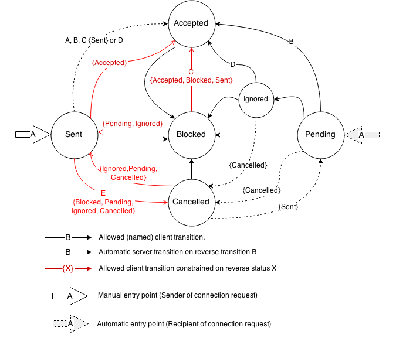
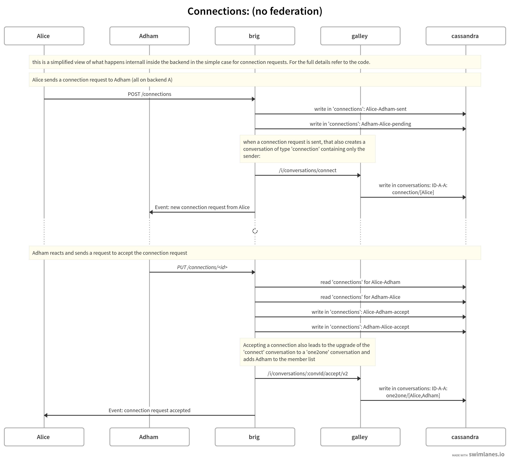

# Connection

Reference: {#RefConnection}

Two users can be _connected_ or not. If the users are connected, each of them can:

* Add the other user to a conversation (which is also a requirement for having a 1-1 conversation or doing a call).

* See the locale of the other user.

By default users with personal accounts are not connected. A user can send another user a _connection request_, which can be ignored or accepted by the other user. A user can also block an existing connection.

Members of the same team are always considered connected, see [Connections between team members](RefConnectionTeam).

Internally, connection status is a _directed_ edge from one user to another that is attributed with a relation state and some meta information. If a user has a connection to another user, it can be in one of the six [connection states](RefConnectionStates).

## Connection states

(RefConnectionStates)=

### Sent

(RefConnectionSent)=

In order for two users to become connected, one of them performs a _connection request_ and the other one accepts it. Initiating a new connection results in a pending 1-1 conversation to be created with the sender as the sole member. When the connection is accepted, the other user joins the conversation.

The creator of a new connection (i.e. the sender of the connection request) ends up in this state. From the point of view of the creator, it indicates that a connection request has been sent but not accepted (it might be blocked or ignored).

### Pending

(RefConnectionPending)=

The recipient of a connection request automatically ends up in this state.
From his point of view, the state indicates that the connection is pending
and awaiting further action (i.e. through accepting, ignoring or blocking it).

### Blocked

(RefConnectionBlocked)=

When a connection is in this state it indicates that the user does not want to be bothered by the other user, e.g. by receiving messages, calls or being added to conversations.

Blocking a user does not prevent receiving further messages of that user in existing group conversations where the blocked user is a member.

When user A blocks user B, the connection restrictions apply to both users -- e.g. A can not add B to conversations, even though it's A who blocked B and not vice-versa.

### Ignored

(RefConnectionIgnored)=

The recipient of a connection request may decide to explicitly "ignore" the request In this state the sender can continue to send further connection attempts. The recipient can change their mind and accept the request later.

### Cancelled

(RefConnectionCancelled)=

This is a state that the sender can change to if the connection has not yet been accepted. The state will also change for the recipient, unless blocked.

### Accepted

(RefConnectionAccepted)=

A connection in this state is fully accepted by a user. The user thus allows the user at the other end of the connection to add him to conversations.

For two users to be considered "connected", both A->B and B->A connections have to be in the "Accepted" state.

## Transitions between connection states

(RefConnectionTransitions)=



(To edit this diagram, open [connection-transitions.xml](connection-transitions.xml) with <https://draw.io>.)

## Connections between team members

(RefConnectionTeam)=

Users belonging to the same team are always implicitly treated as connected, to make it easier for team members to see each other's profiles, create conversations, etc.

Since there is no explicit connection state between two team members, changing the connection status (e.g. blocking a fellow team member) is impossible.

# Connection backend internals

In the regular case of a single backend (no federation involved), and in the easiest case of two users Alice and Adham which want to start talking, the simplified internals involving the services brig and galley and cassandra can be seen as follows: (as of 2021-08)



<details>
<summary>(To edit this diagram, copy the code in this details block to https://swimlanes.io )</summary>

```
title: Connections: (no federation)

note: this is a simplified view of what happens internall inside the backend in the simple case for connection requests. For the full details refer to the code.

note: Alice sends a connection request to Adham (all on backend A)

order: Alice, Adham, brig, galley, cassandra

Alice -> brig: POST /connections

brig -> cassandra:  write in 'connections': Alice-Adham-sent
brig -> cassandra:  write in 'connections': Adham-Alice-pending
note brig, galley: when a connection request is sent, that also creates a conversation of type 'connection' containing only the sender:
brig -> galley: /i/conversations/connect
galley -> cassandra: write in conversations: ID-A-A: connection/[Alice]
brig -> Adham: Event: new connection request from Alice

...: {fas-spinner}

note Alice, cassandra: Adham reacts and sends a request to accept the connection request

Adham -> brig: *PUT /connections/<id>*
brig -> cassandra: read 'connections' for Alice-Adham
brig -> cassandra: read 'connections' for Adham-Alice
brig -> cassandra:  write in 'connections': Alice-Adham-accept
brig -> cassandra:  write in 'connections': Adham-Alice-accept

note brig, galley: Accepting a connection also leads to the upgrade of the 'connect' conversation to a 'one2one' conversation and adds Adham to the member list
brig -> galley: /i/conversations/:convId/accept/v2
galley -> cassandra: write in conversations: ID-A-A: one2one/[Alice,Adham]
brig -> Alice: Event: connection request accepted
```

</details>

The connection / one2one conversation ID is deterministically determined using a combination of the two involved user's UUIDs, using the [addv4](https://github.com/wireapp/wire-server/blob/3b1d0c5acee58bb65d8d72e71baf68dd4c0096ae/libs/types-common/src/Data/UUID/Tagged.hs#L67-L83) function.
