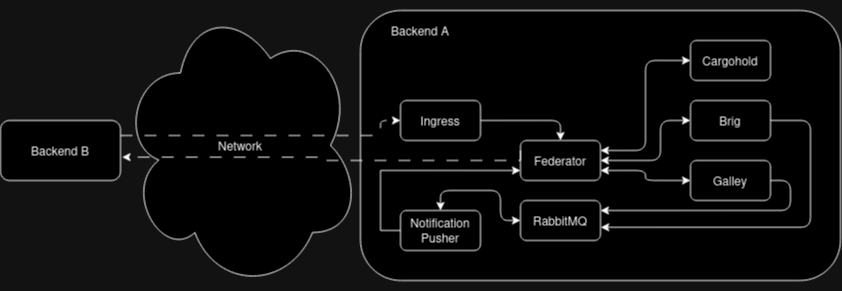

(federation-architecture)=

# Federation Achitecture

(glossary_backend)=

## Backends

In the following we call a **backend** the set of servers, databases and DNS
configurations that together form one single Wire Server entity as seen from the
outside. It can also be called a Wire \"instance\" or \"server\" or \"Wire
installation\". Every resource (e.g. users, conversations, assets and teams)
exists and is *owned* by a single backend, which we can refer to as that
resource\'s backend.

The communication between federated backends is facilitated by two components in
each backend: {ref}`federation_ingress` and {ref}`federator`. The *Federation
Ingress* is, as the name suggests, the ingress point for incoming connections
from other backends, which are then forwarded to the *Federator*. The
*Federator* forwards requests to internal components. It also acts as a *egress*
point for requests from internal backend components to other, remote backends.

(backend-domains)=

(glossary_infra_domain)=
(glossary_backend_domain)=

## Backend domains

Each backend has two domain: an {ref}`infrastructure domain <glossary_infra_domain>` and a
{ref}`backend domain <glossary_backend_domain>`.

The **infrastructure domain** is the domain name under which the backend
is actually reachable via the network. It is also the domain name that
each backend uses in authenticating itself to other backends.

Similarly, there is the **backend domain**, which is used to {ref}`qualify <qualified-identifiers-and-names>` the
names and identifiers of users local to an individual backend in the
context of federation.

The distinction between the two domains allows the owner of a backend
domain, e.g. `example.com`, to host their Wire backend under a
different infrastructure domain, e.g. `wire.infra.example.com`.

(federation_ingress)=

## Federation Ingress

The *Federation Ingress* is a [Kubernetes
ingress](https://kubernetes.io/docs/concepts/services-networking/ingress/)
and uses [nginx](https://nginx.org/en/) as its underlying software.

It is configured with a set of X.509 certificates, which acts as root of
trust for the authentication of the infrastructure domain of remote backends, as
well as with a certificate, which it uses to authenticate itself toward
other backends.

Its functions are:

- to terminate TLS connections
- to perform mutual {ref}`authentication` as part of the TLS connection establishment
- to forward requests to the local {ref}`federator` instance, along with the
    remote backend\'s client certificate

(federator)=

## Federator

The *Federator* performs additional authorization checks after receiving
federated requests from the *Federation Ingress* and acts as egress
point for other backend components. It can be configured to use an
{ref}`allow list
<allow-list>` to authorize incoming and
outgoing connections, and it keeps an X.509 client certificate for the
backend\'s infrastructure domain to authenticate itself towards other backends.
Additionally, it requires a connection to a DNS resolver to
{ref}`discover<discovery>` other backends.

When receiving a request from an internal component, the *Federator*
will:

1. If enabled, ensure the target domain is in the allow list,
2. Discover the other backend,
3. Establish a {ref}`mutually authenticated channel <authentication>` to the other backend using its client certificate,
4. Send the request to the other backend and
5. Forward the response back to the originating component (and
    eventually to the originating Wire client).

The *Federator* also implements the authorization logic for incoming
requests and acts as intermediary between the *Federation Ingress* and
the internal components. The *Federator* will, for incoming requests
from remote backends (forwarded via the local
{ref}`Federation Ingress <federation_ingress>`):

1. Discover the mapping
    between backend domain claimed by the remote backend and its infra
    domain,
2. Verify that the discovered infrastructure domain matches the domain in the
    remote backend\'s client certificate,
3. If enabled, ensure that the backend domain of the other backend is
    in the allow list.
4. Forward requests to other wire-server components.

(other-wire-server)=

## Service components

Components such as Brig, Galley, Cargohold are responsible
for actual business logic and interfacing with databases and
non-federation related external services. See [source code
documentation](https://github.com/wireapp/wire-server). In the context
of federation, their functions include:

- For incoming requests from other backends:
    {ref}`per-request authorization<per-request-authorization>`
- Outgoing requests to other backends are always sent via a local
    Federator instance.

For more information of the functionalities provided to remote backends
through their *Federator*, see the
{ref}`federated API documentation<api-endpoints>`.
